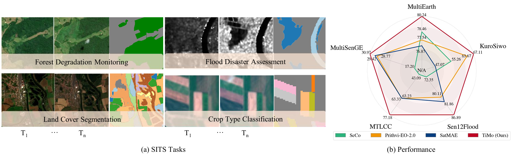

<p align="center">

  <h2 align="center"><strong>TiMo: Spatiotemporal Foundation Model for Satellite Image Time Series</strong></h2>

<div align="center">
<h5>
<em>Xiaolei Qin<sup>1 *</sup>, Di Wang<sup>1,2 *</sup>, Jing Zhang<sup>1 †</sup>, Fengxiang Wang<sup>3 </sup>, Xin Su<sup>1</sup>, Bo Du<sup>1,2</sup>, Liangpei Zhang<sup>1</sup></em>
    <br><br>
       	<sup>1</sup> Wuhan University, China,<br/>
        <sup>2</sup> Zhongguancun Academy, China,<br/> 
        <sup>3</sup> National University of Defense Technology, China<br/> 
</h5>
<h5>
<sup>∗</sup> Equal contribution, <sup>†</sup> Corresponding author
</h5>
</div>


<h5 align="center">
<a href="https://arxiv.org/pdf/2505.08723"> </a>
</h5>


# 🔥 Update
**2025.05.14**
- We uploaded our work on [arXiv](https://arxiv.org/pdf/2505.08723).

# 🌞 Intro
TiMo is a novel hierarchical vision transformer foundation model tailored for SITS analysis. At its core, we introduce a spatiotemporal gyroscope attention mechanism that dynamically captures evolving multiscale patterns across both time and space. For pre-training, we curate MillionST, a large-scale dataset of one million images from 100,000 geographic locations, each captured across 10 temporal phases over five years, encompassing diverse geospatial changes and seasonal variations. Leveraging this dataset, we adapt masked image modeling to pre-train TiMo, enabling it to effectively learn and encode generalizable spatiotemporal representations. Extensive experiments across multiple spatiotemporal tasks—including deforestation monitoring, land cover segmentation, crop type classification, and flood detection—demonstrate TiMo's superiority over state-of-the-art methods.

# 🔍 Overview
<figure>
<div align="center">

</div>
<div align="center">
<figcaption align = "center"><b>Figure 1. TiMo surpasses existing spatiotemporal RSFMs, delivering superior performance across diverse SITS tasks, including forest monitoring, disaster assessment, ground-object recognition, and agricultural identification. 
 </b></figcaption>
</div>
</figure>

# 📖 Datasets
The MillionST dataset will be released soon.


# 🔨 Evaluation code
The code will be released soon.

# ⭐ Citation

If you find TiMo helpful, please consider giving this repo a ⭐ and citing:

```latex
@article{TiMo,
      title={TiMo: Spatiotemporal Foundation Model for Satellite Image Time Series}, 
      author={Xiaolei Qin and Di Wang and Jing Zhang and Fengxiang Wang and Xin Su and Bo Du and Liangpei Zhang},
      journal={arXiv preprint arXiv:2505.08723}
      year={2025}
}
```
